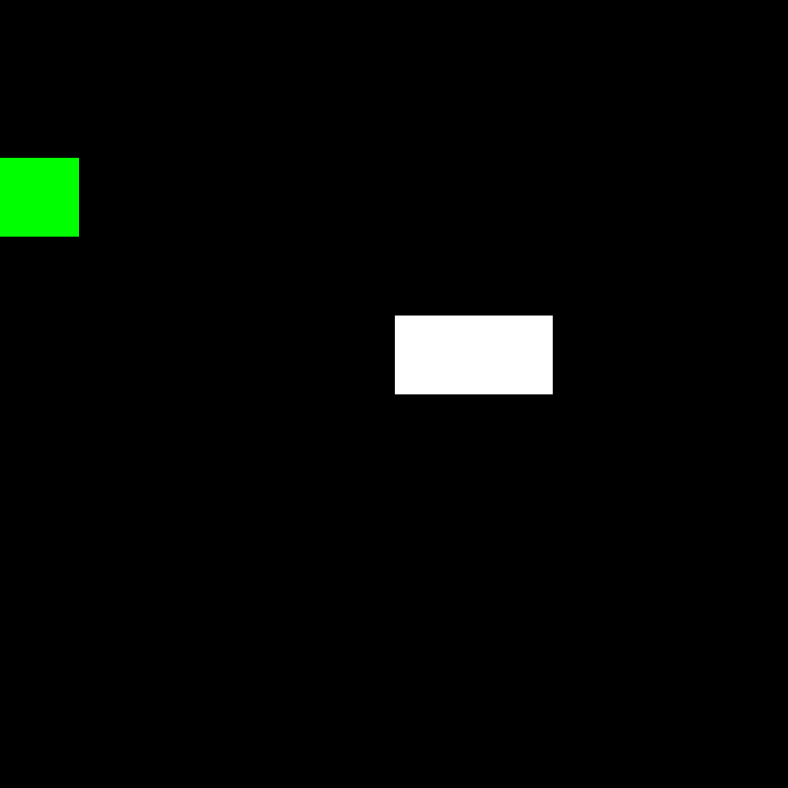

# neat

A rust library implementaiton of [NeuroEvolution of Augmenting Topologies](http://nn.cs.utexas.edu/downloads/papers/stanley.ec02.pdf). NEAT is a genetic learning algorithm that generates both the network weights and topology. You can use this library to train a network on various tasks.

Snake being played by a Network trained with this library.

You can look more into this in [examples/snake.rs](examples/snake.rs).

## Usage

```toml
[dependencies]
neat = { git = "https://github.com/jspspike/neat" }
```

Implement `Task` on the struct containing the logic for the task you want to train using NEAT.
An example of this can be found here [examples/snake.rs](examples/snake.rs).
Then use `Neat` to train on this task.
```rust
use neat::Neat;

let mut neat = Neat::<ImplementedTask>::default(1000, 2, 1);

// `step` will execute and train on one generation of genomes.
// It returns the network and fitness of the most fit genome in that step
let (network, fitness) = neat.step();
```

Finally you can use the `Network` to execute your task. If you have the struct that implements
`Task` you can pass that to it directly or use the `prop` function to get one step. You can
find an example of this in [examples/run-snake.rs](examples/run-snake.rs)
```rust
use neat::Network;

let mut inputs = !vec[0.0];

loop {
    let outputs = network.prop(inputs);
    inputs = task.do_stuff(outputs);
}
```

## Documentation

There are doc comments in the library so use `cargo doc` for now.
